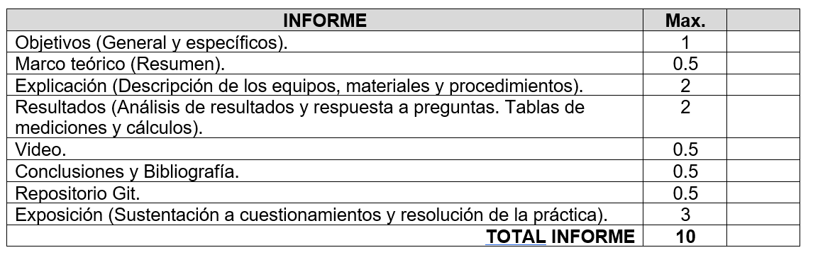

## Los objetivos 

**deben**

responder claramente la pregunta ¿Qué investigar? El objetivo de la investigación es el enunciado claro y preciso de las metas que se persiguen. En los objetivos de la investigación se detallan las acciones en las que debe emprender el investigador para contestar a las preguntas planteadas en la formulación y sistematización del problema y tiene como propósito el dir

